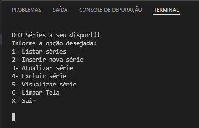

# Criando um APP simples de cadastro de séries em .NET

<p align="center"><a href="https://www.dio.me/">
  </a>
  </p>
  
Aplicativo criado no curso de .NET da Digital Innovation One

  <!--ts-->
- [Criando um APP simples de cadastro de séries em .NET](#criando-um-app-simples-de-cadastro-de-séries-em-net)
  - [ℹ️ About](#ℹ️-about)
  - [⁉️ Motivation](#️-motivation)
  - [🌱 Minimum Requirements](#-minimum-requirements)
  - [🚀 Technologies Used](#-technologies-used)
  - [🔗 How to run](#-how-to-run)
  - [📝 License](#-license)
  <!--te-->

<p align="center">

</p>

## ℹ️ About

A aplicação consiste em um sistema de cadastro e manutenção de séries na memória realizado no .NET.

Seguindo as orientações do professor da DIO, Eliézer Zarpelão ([@elizarp](https://github.com/elizarp)).

## ⁉️ Motivation

The *Criando um APP simples de cadastro de séries em .NET* course is part of *#[DIO's MRV Bootcamp.](https://web.dio.me/track/mrv-fullstack-developer)*, a partnership between [Digital Innovation One](https ://github.com/digitalinnovationone), [Orbi Conecta](https://github.com/orbiconecta) and #MRV&CO.

## 🌱 Minimum Requirements


[](https://dotnet.microsoft.com/)


## 🚀 Technologies Used

The project was developed using the following technologies:

- DOTNET 3.1
- CRUD
- Collections


## 🔗 How to run

To copy the project, use the commands:

```bash
  # Clone the repository
  ❯ git clone https://github.com/luandiasrj/Criando-um-APP-simples-de-cadastro-de-s-ries-em-.NET.git
  # Enter the directory
  ❯ cd Criando-um-APP-simples-de-cadastro-de-s-ries-em-.NET
```


To install the dependencies and start the project:

```bash
  # Start the project
  ❯ dotnet run
```

## 📝 License

<p align="center">
  <a rel="license" href="http://creativecommons.org/licenses/by/4.0/">
  </a>
<br />Este obra está licenciado com uma Licença <a rel="license" href="http://creativecommons.org/licenses/by/4.0/">Creative Commons Atribuição 4.0 Internacional</a>.
  
</p>
  
</p>

* * *
<h4 align="center">
  Made with ❤️ by luandiasrj 👋️ <a href="mailto:luandias@outlook.com">Get in touch!</a>
</h4>

<p align="center">
  
<a href="https://www.linkedin.com/in/luan-bernardo-dias"/>
</a>

<a href="https://www.instagram.com/luandiasrj/"/>
</a>
  
</p> 